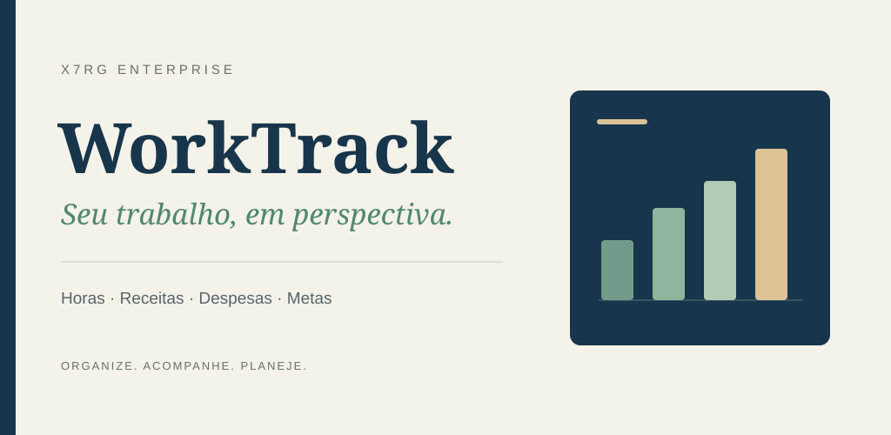
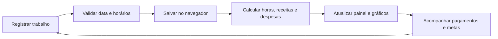

<div align="center">


# WorkTrack

[](https://github.com/xx7rg/worktrack/actions/workflows/ci.yml)



**Transforme horas trabalhadas em uma visão clara de receitas, despesas, pagamentos e metas.**


Publicado por **x7rG ENTERPRISE™**

</div>

---

## Sobre o projeto

O **WorkTrack** é um livro-caixa pessoal para profissionais que precisam registrar serviços sem depender de planilhas ou de uma plataforma empresarial complexa. Cada trabalho reúne cliente, categoria, data, horário, pausa, valor por hora, despesas e situação do pagamento.

A aplicação transforma esses registros em indicadores semanais e mensais, mostrando quanto foi produzido, recebido, gasto e ainda está pendente. Todos os dados ficam no `localStorage` do próprio navegador: não há conta, servidor externo nem envio de informações pessoais.

## O que é possível acompanhar

- Cadastro, edição e exclusão de trabalhos.
- Horas líquidas calculadas a partir da entrada, saída e pausa.
- Receitas brutas, despesas, resultado líquido e valor médio por hora.
- Pagamentos recebidos e pendentes.
- Metas personalizadas de ganhos e horas por semana e por mês.
- Visões por dia, cliente, semana e mês com gráficos interativos.
- Histórico com busca e filtros por cliente, categoria e data.
- Calendário mensal com destaque para dias trabalhados.
- Perfil local, três temas visuais e layout responsivo.

## Como funciona



O WorkTrack inicia vazio. Depois do primeiro registro, o mesmo conjunto de dados alimenta todas as telas e permanece disponível naquele navegador até ser removido nas configurações.

## Tecnologias

| Camada | Tecnologia |
| --- | --- |
| Interface | React 19, TypeScript e Tailwind CSS 4 |
| Gráficos | Recharts |
| Build | Vite 7 e esbuild |
| Servidor de produção | Express |
| Persistência | Web Storage (`localStorage`) |

## Executar localmente

Requer **Node.js 20.19+ ou 22.12+** e **pnpm 10.34.5**, versão fixada em `packageManager`.

```bash
git clone https://github.com/xx7rg/worktrack.git
cd worktrack
pnpm install
pnpm dev
```

Abra o endereço exibido pelo Vite no terminal. Em discos que não suportam links simbólicos, use `pnpm install --node-linker=hoisted`.

## Comandos

| Comando | Função |
| --- | --- |
| `pnpm dev` | Inicia o ambiente de desenvolvimento. |
| `pnpm check` | Verifica os tipos TypeScript. |
| `pnpm build` | Gera o frontend e o servidor em `dist/`. |
| `pnpm test` | Após o build, verifica a página, as rotas e os arquivos estáticos no servidor compilado. |
| `pnpm preview` | Abre uma prévia do frontend compilado. |
| `pnpm start` | Executa o servidor compilado após o build. |

O CI instala pelo lockfile e executa a verificação de tipos, o build, o teste
do servidor e a auditoria de dependências. Para repetir essas verificações:

```bash
pnpm install --frozen-lockfile
pnpm check
pnpm build
pnpm test
pnpm audit --audit-level high
```

## Estrutura principal

```text
client/
├── public/images/       # Imagens locais usadas na interface
└── src/
    ├── components/      # Componentes visuais reutilizáveis
    └── pages/Home.tsx   # Fluxos, cálculos e telas do painel
server/                  # Servidor Express para a versão compilada
docs/images/             # Identidade visual usada no README
```

## Privacidade

Os registros são gravados somente no navegador em uso. Limpar os dados do site, trocar de navegador ou usar a opção **Apagar dados locais** remove essas informações. Para manter a privacidade, o projeto não inclui analytics nem serviços de rastreamento.

---

<div align="center">

**© 2026 x7rG ENTERPRISE™** — Todos os direitos reservados.

[](https://www.linkedin.com/in/rgds)
&nbsp;
[](https://www.instagram.com/_7ragnar/)

</div>
